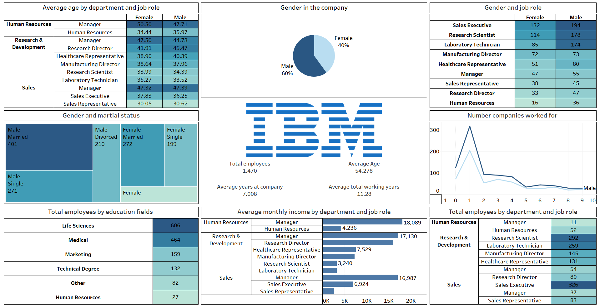

# 📊 IBM HR Analytics Dashboard  
**Employee Demographics • Salary Insights • Workforce Structure**

This project is an interactive Tableau dashboard created to analyze IBM's human resources data.  
It provides insights into employee demographics, job roles, gender distribution, income levels, and more through visual analytics.

---

## 📁 Dashboard Preview

> Ensure `IBM_HR_Dashboard.png` is stored in the same folder as this README file.

---

## 📌 Project Overview

The goal of this project is to explore, analyze, and visualize IBM’s HR dataset to uncover key workforce patterns such as:

- Gender distribution  
- Average age by department & job role  
- Marital status breakdown  
- Employee education backgrounds  
- Total employees by role and department  
- Salary patterns across job roles  
- Employee career history (e.g., number of companies worked for)

This dashboard helps HR teams understand employee structure, diversity, and compensation insights.

---

## 🧩 Key Features & Visualizations

### 🔹 **1. Average Age by Department and Job Role**
- Shows average male & female ages across job roles  
- Heatmap visualization for quick comparison  
- Identifies age distribution patterns within departments  

---

### 🔹 **2. Gender Distribution in the Company**
- Pie chart showing female vs male employee percentages  
- KPI cards include:  
  - Total employees  
  - Average Age  
  - Average years at the company  
  - Average total working years  

---

### 🔹 **3. Gender and Job Role Breakdown**
- Table with male & female employee counts for each job role  
- Helps analyze gender balance in different positions  

---

### 🔹 **4. Marital Status Breakdown by Gender**
- Treemap visualization  
- Shows groups like Male Married, Female Married, Male Single, Female Divorced, etc.  

---

### 🔹 **5. Number of Companies Worked For**
- Line chart comparing male & female career history  
- Shows how many companies employees have worked at  
- Useful for analyzing hiring patterns and workforce mobility  

---

### 🔹 **6. Total Employees by Education Field**
- Table showing count of employees from each field:  
  - Life Sciences  
  - Medical  
  - Marketing  
  - Technical Degree  
  - Human Resources  
  - Others  

---

### 🔹 **7. Average Monthly Income by Department and Job Role**
- Horizontal bar chart  
- Displays salary ranges for each job role  
- Helps compare income levels across departments  

---

### 🔹 **8. Total Employees by Department & Job Role**
- Heatmap-style table  
- Shows total employee count for each role under HR, R&D, and Sales  

---

## 🛠 Tools & Technologies Used

| Tool | Purpose |
|------|---------|
| **Tableau Desktop** | Dashboard creation & visualization |
| **CSV/Excel Data** | Data source |
| **Data Cleaning** | Preparing dataset for Tableau |
| **Calculated Fields** | Creating new metrics |
| **Filters & Parameters** | For dashboard interactions |

---

## 📂 Files Included

